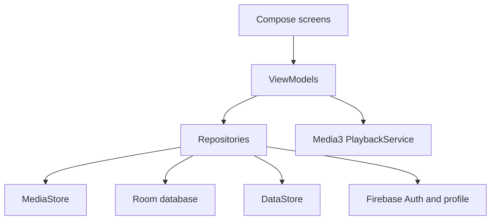

# Rockstar

Rockstar is a Jetpack Compose local music-player app for Android. It scans audio already stored on the device, supports Firebase email/password accounts, plays music through AndroidX Media3, and keeps personal library data local to the app.

## Features

- Firebase registration, login, session restoration, password reset, profile editing and logout
- Runtime audio permission flow for local media access
- MediaStore song, album and artist scanning with artwork
- Search and sorting across the local music library
- Media3 playback engine with `ExoPlayer`, `MediaSessionService`, notification/system controls, queues, shuffle, repeat and seeking
- Persistent mini-player and Now Playing screen
- Room-backed liked songs, playlists and playback history scoped by Firebase UID
- Playlist creation, rename, deletion, add/remove songs and playlist playback
- Real Recently Played and transparent local recommendations based on likes and listening history
- DataStore-backed theme and playback preferences
- Dark, light and system theme modes
- Rockstar launcher icon with legacy, round, adaptive and themed icon resources

## Screenshots

Screenshots are not committed yet. Add release screenshots here when available.

## Technology Stack

- Kotlin
- Jetpack Compose and Material 3
- AndroidX Navigation Compose
- Firebase Authentication and Realtime Database profile storage
- AndroidX Media3 (`ExoPlayer`, `MediaSession`, `MediaController`)
- Android MediaStore for local audio discovery
- Room for personal local data
- DataStore Preferences for app settings
- Coil for album artwork loading
- JUnit and AndroidX test libraries

## Architecture

Rockstar uses a single-activity Compose architecture with MVVM and repositories.



Key packages:

- `model/` — app models such as `Song`, `Album`, `Artist` and `User`
- `repo/` — repository contracts and implementations
- `data/local/` — Room database, DAOs and entities
- `data/preferences/` — DataStore preferences
- `playback/` — Media3 service, controller, state mapping and restoration
- `viewmodel/` — UI state and screen/application ViewModels
- `ui/` — Compose components and screens
- `navigation/` — destinations and navigation graph

## Firebase Setup

The project expects Firebase configuration through the standard Android `google-services.json` file under `app/`. Do not commit private Firebase service-account credentials or signing keys.

Realtime Database/profile rules must allow authenticated users to read and write only their own profile data. Personal music data such as likes, playlists and playback history is not stored in Firebase; it remains in the local Room database and is scoped by Firebase Auth UID.

## Audio Permission and MediaStore

Rockstar requests Android audio access (`READ_MEDIA_AUDIO` on API 33+, `READ_EXTERNAL_STORAGE` up to API 32) to scan audio already stored on the device. It does not use all-files access, copy audio files into the app, or store audio bytes in Room.

MediaStore IDs and content URIs can become stale if device media changes. Room stores song snapshots for display, while playback queues use available local `content://` URIs.

## Playback Architecture

Playback is owned by `PlaybackService`, a `MediaSessionService` that owns a single Media3 `ExoPlayer` and `MediaSession`. App UI connects through a `MediaController` via the playback controller abstraction. Composables and music-library ViewModels do not create or own `ExoPlayer`.

## Room Database

Room database version: `1`.

Primary tables:

- `saved_songs` — local song metadata snapshots
- `liked_songs` — liked song IDs by `ownerUid`
- `playlists` — playlists by `ownerUid`
- `playlist_songs` — ordered playlist membership
- `playback_history` — qualified playback events by `ownerUid`

Schema JSON is exported under `app/schemas/`.

## DataStore Preferences

DataStore stores small preferences only:

- theme mode (`System`, `Dark`, `Light`)
- default library sort settings foundation
- queue restoration preference

Large personal records belong in Room, not DataStore.

## Build

```sh
./gradlew clean
./gradlew assembleDebug
```

Release artifacts can be attempted with:

```sh
./gradlew assembleRelease
./gradlew bundleRelease
```

If no signing configuration is provided, release outputs are unsigned or use the default debug/dev configuration as determined by the Android Gradle Plugin. Do not commit keystores or signing passwords.

## Tests and Lint

```sh
./gradlew testDebugUnitTest
./gradlew lintDebug
```

Instrumented tests require a connected emulator or Android device:

```sh
./gradlew connectedDebugAndroidTest
```

## Branch Workflow

- `main` remains the stable baseline.
- `development` integrates completed phases.
- Feature work is done on feature branches such as `feature/personal-library-and-release`.
- Phase 5 should not be merged into `development` until reviewed.

## Privacy and Backup Behavior

Personal library records are stored locally and scoped by Firebase UID. Logging out clears in-memory state and stops playback, but does not delete local likes, playlists or history. Settings provides explicit destructive actions for the current account.

Backup XML excludes the Room database and transient playback state because MediaStore references may not remain valid on another device.

## Known Limitations

- Rockstar plays local device audio only; it does not stream cloud music.
- Recommendations are deterministic local ranking, not machine learning.
- Playlist artwork collages are not implemented.
- Manual launcher-icon verification requires installing on an emulator/device and checking the launcher, recents and App Info.

## Release Information

Initial release configuration uses the app’s configured `applicationId`, target SDK and version settings from `app/build.gradle.kts`. Before Play Store release, configure private signing outside the repository, complete policy review, and manually verify playback/background behavior on real devices.
